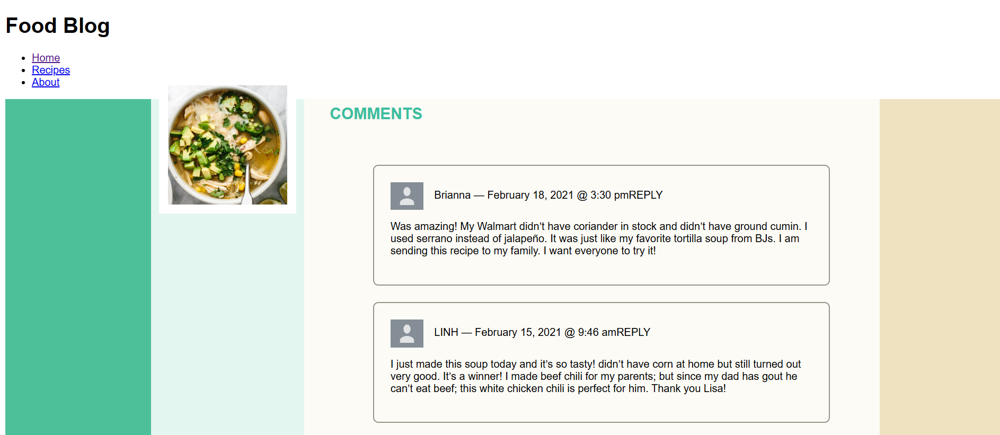

# wk1-d3-food-blog
Web-602-Spring 2025

## Food Blog Project
This project demonstrates the use of Express.js and Pug as a templating engine to create a modular, responsive Food Blog web application. It includes separate components for the header, footer, and content, ensuring clean and reusable code.

## Features
Modular design using Pug templating (header.pug, footer.pug, and content.pug).
Responsive layout with a visually appealing header, footer, and blog content.
Dynamic rendering using Vue.js.
Easy setup and start using Node.js and Express.js.

## Installation
### Clone the repository:
```
    $git clone https://github.com/SRai22/wk1-d3-food-blog.git
```
### Navigate to the project directory:
```
    $cd wk1-d3-food-blog/
```

### Install dependencies:
```
    $npm install
```

## Usage
### Start the Server
Use one of the following commands to start the server:

Start in Production Mode:
```
    $npm start
```
Start in Development Mode (with live reload):
```
    $npm run dev
```

## Preview
This will be how the page looks: 


